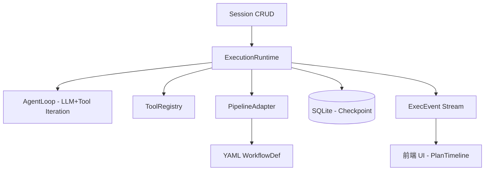

# Session 自主执行 — 统一 ExecutionRuntime 设计

> 设计日期：2026-05-26
> 状态：待实现
> 关联：Session 模块重构、AgentLoop、PipelineEngine

## 1. 背景与目标

### 现状问题

当前 Session 是"一问一答"的薄壳：

```
用户消息 → send_message → AgentLoop.run() → 最多 10 轮迭代 → 返回 → 等待下一条
```

AgentLoop 虽然支持多轮工具迭代，但 Session 层没有"任务意识"。用户给出复杂目标（如"重构这个模块"）后，Agent 完成一轮回答就停止，缺乏自主继续工作的能力。同时 PipelineEngine（YAML 工作流）与 Session 完全隔离，无法在对话中触发和跟踪。

### 设计目标

1. **统一执行运行时**：合并 AgentLoop（LLM 多轮迭代）和 PipelineEngine（预定义步骤）的执行模型
2. **自主工作流**：用户给出目标后，Agent 自动生成执行计划并逐步执行
3. **自动模式切换**：根据意图自动从 Chat 模式升级到 Autonomous 模式
4. **Pipeline 集成**：YAML 工作流可作为 Plan 源，Agent 可动态触发 Pipeline
5. **可观测**：每一步的进度、结果、时长对用户可见

## 2. 核心架构

### 2.1 统一执行步骤（ExecStep）

```rust
pub enum ExecStep {
    /// 完整 Agent 循环：LLM + 工具调用，允许多轮迭代
    AgentTask {
        instruction: String,
        model_id: Option<String>,
        max_iterations: usize,
        allowed_tools: Vec<String>,
        temperature: Option<f32>,
    },
    /// 单次 LLM 调用（无工具）
    LlmCall {
        prompt: String,
        system_prompt: Option<String>,
        model_id: Option<String>,
        temperature: Option<f32>,
        max_tokens: Option<u32>,
    },
    /// 单次工具调用
    ToolCall {
        tool: String,
        params: HashMap<String, Value>,
        retry: Option<RetryConfig>,
        timeout_seconds: Option<u64>,
    },
    /// 条件分支
    Condition {
        expression: String,
        on_true: BranchTarget,
        on_false: BranchTarget,
    },
}
```

`ExecStep` 统一了 AgentLoop 的"隐式步骤"和 PipelineEngine 的"显式步骤"，使两种执行模式共享相同的基础设施。

### 2.2 执行计划（ExecutionPlan）

```rust
pub enum PlanSource {
    Dynamic { goal: String, generated_by: String },
    Static(WorkflowDef),
}

pub struct ExecutionPlan {
    pub id: String,
    pub session_id: String,
    pub source: PlanSource,
    pub steps: Vec<PlanStep>,
    pub status: PlanStatus,
    pub created_at: String,
    pub finished_at: Option<String>,
}

pub struct PlanStep {
    pub id: String,
    pub label: String,
    pub execution: ExecStep,
    pub status: StepStatus, // pending | running | completed | failed | skipped
    pub result: Option<Value>,
    pub error: Option<String>,
    pub started_at: Option<String>,
    pub duration_ms: Option<u64>,
}
```

### 2.3 ExecutionRuntime

```
Session Commands
    │
    ▼
ExecutionRuntime (统一运行时)
    │
    ├── 接收 ExecutionPlan（三种来源）
    ├── 遍历 ExecStep 分发执行
    ├── 维护 StepResults 上下文
    ├── 发射 ExecEvent（progress/error/phase_change）
    ├── Checkpoint 持久化到 DB
    └── 支持 pause/cancel/resume
```

ExecutionRuntime 是新的编排层，AgentLoop 和 PipelineEngine 的现有逻辑作为内部实现被复用：
- `ExecStep::AgentTask` → 调用 AgentLoop 内部逻辑
- `ExecStep::ToolCall` → 调用 ToolRegistry
- `ExecStep::LlmCall` → 调用 LLM Provider
- `ExecStep::Condition` → 模板引擎判断

### 2.4 架构关系



## 3. Session 扩展

### 3.1 新增字段

```rust
// Session struct 扩展
pub mode: SessionMode,              // chat | autonomous
pub execution_status: ExecStatus,   // 当前执行状态
pub active_plan_id: Option<String>, // 当前 Plan
pub plan_history: Vec<String>,      // 历史 Plan ID 列表
```

### 3.2 执行状态机

```
Idle ──(用户消息 + autonomous 意图)──→ Running
  ▲                                       │
  │                           ┌───────────┼───────────┐
  │                           ▼           ▼           ▼
  │                       Completed    Failed     Cancelled
  │                           │           │           │
  └───────────────────────────┴───────────┴───────────┘
                                      (back to Idle)

Running ←──(pause)──→ Paused
Paused  ──(resume)──→ Running
```

### 3.3 自动模式切换

现有 `send_message_stream` 中的 Intent Routing 扩展：

```rust
fn should_auto_escalate(intent: &IntentResult) -> bool {
    matches!(intent.name.as_str(),
        "implement" | "refactor" | "research"
        | "bugfix" | "analyze" | "debug"
    )
}
```

- Chat 模式收到 Autonomous 意图 → 自动升级，生成 Plan 执行
- 执行完成后 Session 回到 Idle，但保留 Autonomous 模式
- 执行中用户可随时发消息打断（中断当前 Plan，用户新消息作为新输入）

### 3.4 Plan 确认策略

```rust
enum PlanConfirmation {
    /// 不确认直接执行（适合信任模型）
    Auto,
    /// 总是展示 Plan 等待用户确认（安全优先）
    Always,
    /// 仅当 Plan 涉及写操作时确认（默认）
    OnWriteOperation,
}
```

**默认策略：OnWriteOperation**。执行包含 `write_file`、`delete_file`、`execute_command` 等有副作用的步骤前暂停确认，纯读操作自动执行。
此配置保存在 Session Config 中，前端可在设置面板调整。

## 4. Plan 生成

### 4.1 三种来源

| 来源 | 触发方式 | 生成时间 |
|------|----------|----------|
| Dynamic | 用户自然语言 → LLM Planner | 运行时 |
| Static | 引用预定义 YAML 工作流 | 加载时 |
| Nested | Agent 调用 `trigger_pipeline` 工具 | 执行中 |

### 4.2 LLM Planner

调用 LLM 将用户目标拆解为可执行步骤：

```
Input: "帮我分析 src/ 的代码结构并生成文档"
Output: [
  { "id": "s1", "label": "读取目录结构", "type": "tool_call", "tool": "read_directory", "params": {"path": "src/"} },
  { "id": "s2", "label": "分析模块依赖", "type": "agent_task", "instruction": "分析上一步的目录结构中的模块依赖关系..." },
  { "id": "s3", "label": "生成文档", "type": "agent_task", "instruction": "基于分析结果生成 Markdown 文档..." },
]
```

### 4.3 Re-plan

步骤执行结果不符合预期时，在步骤过渡点调用 LLM 评估：

```
步骤 2 结果与预期不符 → LLM 判断：
  ├── 调整剩余步骤继续
  ├── 插入新步骤
  └── 放弃（标记 Plan Failed）
```

## 5. 错误处理

| 步类型 | 默认策略 | 说明 |
|--------|----------|------|
| ToolCall | Retry(3, 1s退避) → RePlan | 工具调用可重试 |
| AgentTask | RePlan | LLM 上下文可能变化，重试意义不大 |
| LlmCall | Retry(3) → Skip | 网络类错误可重试 |
| Condition | Abort | 条件表达式错误无法恢复 |

## 5.5 执行中用户消息处理

Plan 正在执行时用户发送新消息：

```rust
enum UserInterruptStrategy {
    /// 丢弃当前 Plan（默认），用户新消息作为 Chat 处理
    /// 用户可重新触发 Autonomous 模式
    AbortPlan,
    /// 完成当前步骤后暂停 Plan，用户新消息作为 Chat 处理，
    /// 用户可恢复 Plan
    PausePlan,
    // 暂不支持：排队、追加到上下文
}
```

**默认策略：AbortPlan**。用户主动发消息意味着意图变更，丢弃当前 Plan 最清晰可预期。

用户中断后 Session 模式回到 Chat。如果用户后续消息再次触发 Autonomous 意图，则重新生成 Plan。

## 6. 持久化

```sql
-- sessions 表新增
ALTER TABLE sessions ADD COLUMN mode TEXT NOT NULL DEFAULT 'chat';
ALTER TABLE sessions ADD COLUMN execution_status TEXT NOT NULL DEFAULT 'idle';
ALTER TABLE sessions ADD COLUMN active_plan_id TEXT;

-- 新表：执行计划
CREATE TABLE execution_plans (
    id TEXT PRIMARY KEY,
    session_id TEXT NOT NULL,
    source TEXT NOT NULL,
    goal TEXT,
    plan_json TEXT NOT NULL,
    status TEXT NOT NULL DEFAULT 'pending',
    created_at TEXT NOT NULL,
    finished_at TEXT,
    FOREIGN KEY (session_id) REFERENCES sessions(id)
);

-- 新表：步骤结果（每步 checkpoint）
CREATE TABLE execution_plan_steps (
    id TEXT PRIMARY KEY,
    plan_id TEXT NOT NULL,
    step_index INTEGER NOT NULL,
    label TEXT NOT NULL,
    step_type TEXT NOT NULL,
    status TEXT NOT NULL DEFAULT 'pending',
    result_json TEXT,
    error TEXT,
    started_at TEXT,
    duration_ms INTEGER,
    FOREIGN KEY (plan_id) REFERENCES execution_plans(id)
);
```

## 7. IPC 命令

```rust
// 新增命令
execute_plan(session_id, plan_json)     // 手动提交 Plan
pause_execution(session_id)             // 暂停
resume_execution(session_id)            // 恢复
cancel_execution(session_id)            // 取消
get_execution_status(session_id)        // 查询状态
get_plan_detail(plan_id)                // 查 Plan 详情
set_session_config(session_id, config)  // 配置确认策略等

// 修改命令
send_message_stream → 增加自动切换逻辑
```

## 8. 前端变更

### 新增组件
- `PlanTimeline.tsx` — 步骤执行进度时间线，嵌入消息列表
- `ExecutionStatusBar.tsx` — 紧凑状态指示器（模式/进度/控制按钮）
- `PlanConfirmDialog.tsx` — Plan 生成后的确认弹窗

### 状态扩展
- `sessionSlice`: `mode`, `executionStatus`, `activePlan`, `planHistory`

### 事件流
利用现有的 `stream_chunk` 事件机制，扩展新的 phase 类型：
- `phase: "planning"` — Plan 生成中
- `phase: "replanning"` — 重新规划中
- `phase: "executing_step"` — 正在执行某步

新增独立事件：
- `plan_progress` — 步骤完成/失败/进行中
- `plan_completed` — Plan 完成摘要

## 9. 实施计划

### Phase 1：ExecutionRuntime + Plan 基础
1. 定义核心数据结构（types.rs）
2. 实现 ExecutionRuntime 循环（runtime.rs）
3. 实现 Checkpoint 持久化
4. 新增 IPC 命令（commands/execution.rs）
5. Session 结构扩展 + DB 迁移
6. 前端基本状态显示 + 暂停/取消按钮

### Phase 2：动态 Plan + 自动切换
1. LLM Planner 实现
2. Intent 路由 + 自动升级
3. send_message_stream 修改
4. Plan 确认对话框
5. Plan 执行时间线 UI
6. Re-plan 机制

### Phase 3：Pipeline 集成
1. WorkflowDef → ExecutionPlan 转换
2. trigger_pipeline 工具
3. 子 Plan 嵌套执行
4. Pipeline 进度事件桥接

### Phase 4：UX 打磨
1. 可折叠 Plan 面板
2. 历史 Plan 复盘
3. 执行配置 UI
4. 快捷键
5. 错误恢复引导

## 10. 向后兼容

- 新建 Session 默认 `mode = chat`，行为完全不变
- 现有 `send_message` / `send_message_stream` 在 chat 模式下不受影响
- 前端只在 Autonomous 模式下显示 Plan 相关 UI
- DB 迁移使用 ALTER TABLE ADD COLUMN，不影响现有数据
